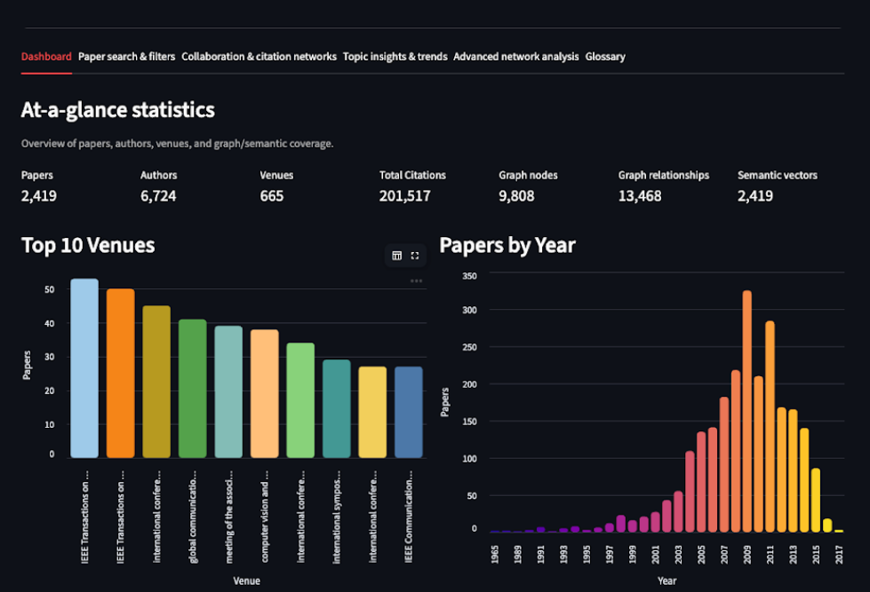
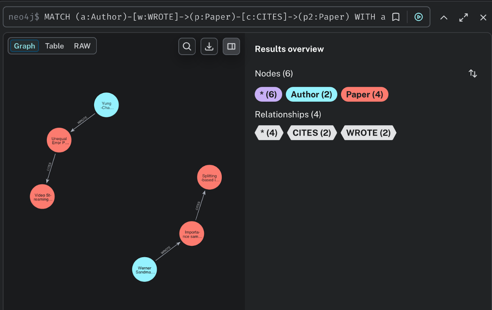
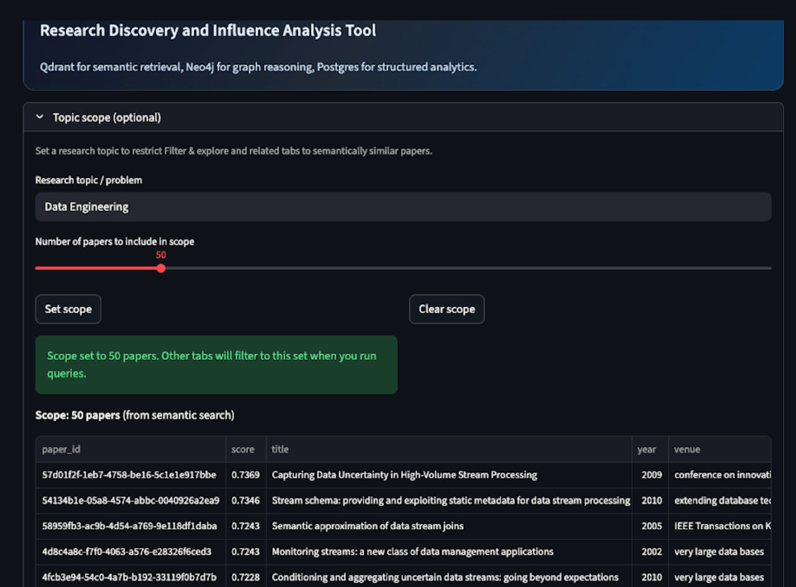

## Scientific Paper Knowledge Graph & Semantic Search



This project ingests the DBLP CSV dataset into:

- **Postgres** (relational): structured paper metadata, authors, and citation edges for filtering + analytics
- **Neo4j** (graph): authorship + citation graph for multi-hop queries (indirect citations, collaboration networks, bridges, clusters)
- **Qdrant** (vector): embeddings of `title + abstract` for semantic search and content-based similarity

It then exposes a small API and demo UI to answer the competency questions in `resources/Topic_Details.md`.

### Repository layout

- `infra/`: docker-compose + database initialization
- `packages/pipeline/`: ingestion + query client code (shared)
- `apps/api/`: FastAPI service (query router)
- `apps/web/`: Streamlit UI (demo)
- `docs/`: schema diagrams + report/slides materials
- `data/`: raw input dataset (provided)

### Quickstart

#### 1) Bring up the stores (Postgres, Neo4j, Qdrant)

```bash
docker compose -f infra/docker-compose.yml up -d
```

#### 2) Create a virtual environment and install deps

```bash
python -m venv .venv
.venv\Scripts\activate
pip install -r requirements.txt
pip install -e packages/pipeline
```

#### 3) Prepare input files

The current ingestion workflow uses:

- `data/raw/matched_main.csv` for Postgres + Qdrant
- Neo4j pre-generated CSV bundle in `data/raw/`:
	- `papers.csv`
	- `authors.csv`
	- `venues.csv`
	- `wrote.csv`
	- `paper_venue.csv`
	- `citations.csv`

These default paths are configured in `packages/pipeline/src/pipeline/settings.py`.

#### 4) Ingest data

Load fresh data into all three stores:

```bash
python -m pipeline.cli ingest-selected --truncate --include-neo4j
```




If Neo4j is already prepared and you only want Postgres + Qdrant:

```bash
python -m pipeline.cli ingest-selected --truncate
```

#### 5) Run the API (terminal 1)

```bash
uvicorn apps.api.main:app --reload --port 8000
```

#### 6) Run the Streamlit UI (terminal 2)

From the project root:

```bash
streamlit run apps/web/app.py
```

If your browser doesn’t open automatically, check the terminal for the **Local URL** (e.g. `http://localhost:8501` or `http://localhost:8503` if 8501 is in use) and open that URL manually.

Open:

- API docs: `http://localhost:8000/docs`
- Streamlit app: `http://localhost:8501` (or the port shown in the Streamlit terminal)



